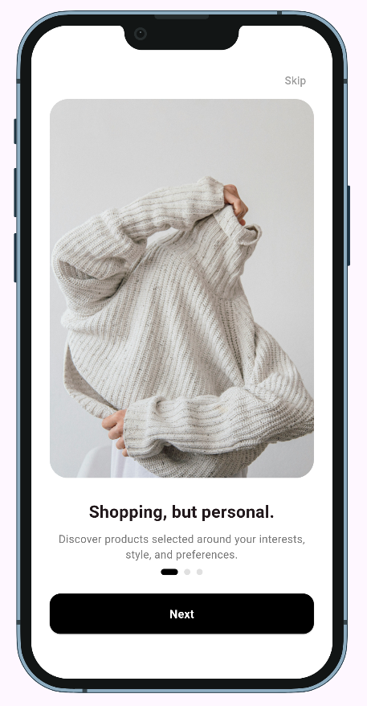
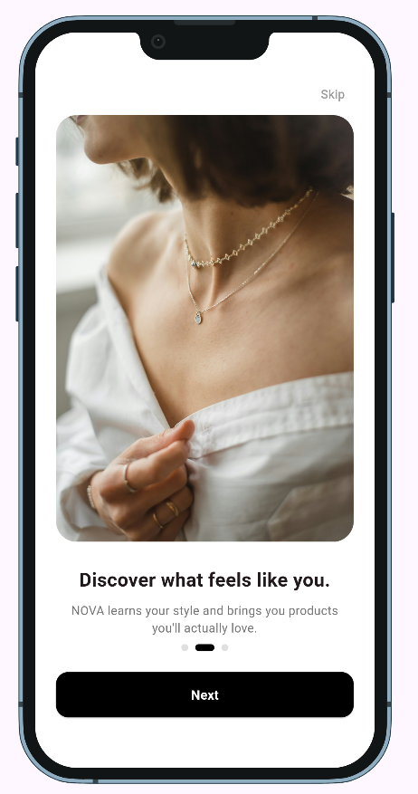
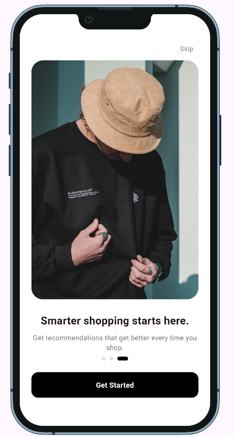
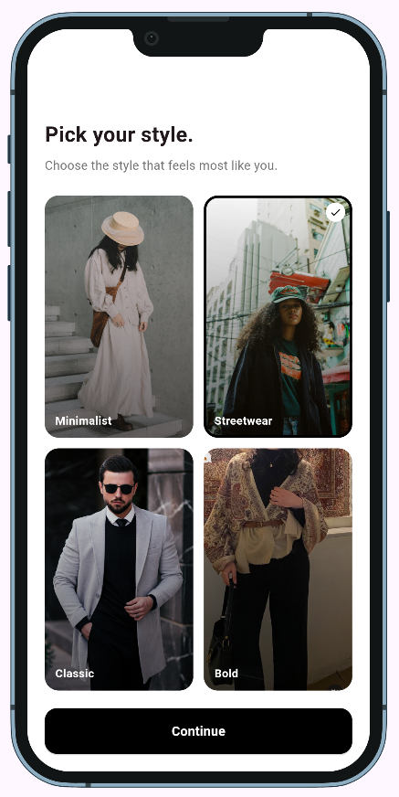
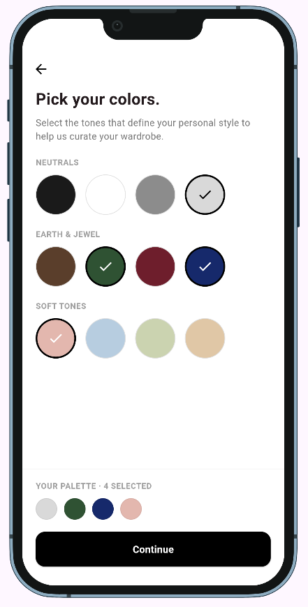
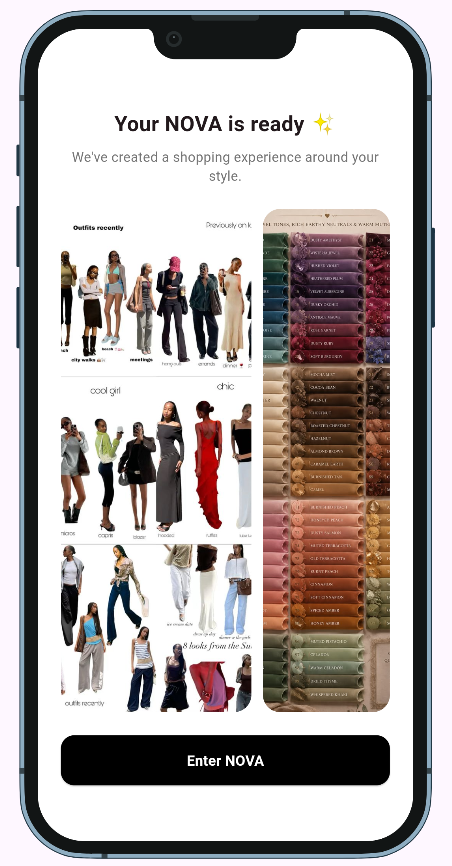

# NOVA E-Commerce App

A new Flutter project.

## Getting Started

This project is a starting point for a Flutter application.

A few resources to get you started if this is your first Flutter project:

- [Lab: Write your first Flutter app](https://docs.flutter.dev/get-started/codelab)
- [Cookbook: Useful Flutter samples](https://docs.flutter.dev/cookbook)

For help getting started with Flutter development, view the
[online documentation](https://docs.flutter.dev/), which offers tutorials,
samples, guidance on mobile development, and a full API reference.

## Onboarding & Preferences Flow

The onboarding feature was implemented using a feature-based architecture and Cubit for state
management.

### Architecture

- Data Layer
    - Models
    - Repository

- Logic Layer
    - Onboarding Cubit
    - Onboarding States

- Presentation Layer
    - Screens
    - Reusable Widgets

---

## Screens

### 1. Onboarding

### 2. Preferences

### 3. Personalization Ready

---

## State Management

The feature uses Cubit for managing:

- Onboarding pages
- User preferences
- Color selection
- Style selection